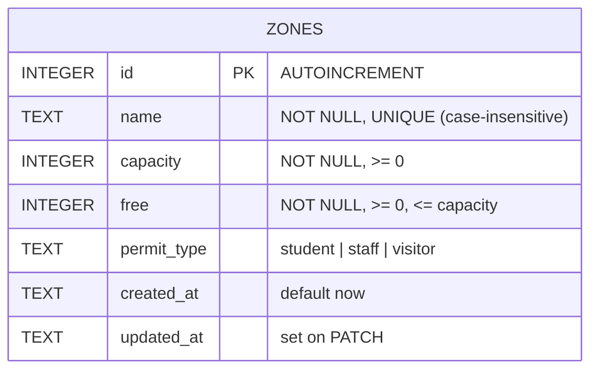

# Midterm Practical Lab: Study Sheet

**Tue 6 Oct 2026, 13:00–17:00.** This sheet covers the six exam topics. Each topic has the code location and a short line to say if you're asked to explain it.

---

## 0. Exam-day runbook

| Time | Do |
|---|---|
| 0:00–0:10 | Read the scenario. Pick **1 main resource (+1 related one if needed)**. Write fields, types, and rules on paper. |
| 0:10–0:30 | `schema.sql` → `npm run db:local` → CRUD routes (copy this repo's pattern) → `npm run dev`. |
| **0:30** | **AI Quality Gate review** (checklist §7). Fix what it finds. |
| 0:30–1:30 | Validation + error codes + CORS for the provided tester. Add filter/pagination if asked. |
| 1:30–2:30 | Tests for success **and** error cases (`npm test`). Screenshot the passing run. |
| 2:30–end | ERD, README, re-read every line so you can explain it. Commit often. |

```bash
npm install && npm run db:local && npm run dev   # API on :8787
npm test                                         # 39 tests, success + error
npm run tester                                   # tester page on :5500
npm run typecheck
```

To adapt this repo to a new scenario: rename `zones` → your resource in `schema.sql`, the zod schemas, the SQL strings, `test/api.test.mjs`, and `requests.http`. The structure stays the same.

---

## 1. REST API design and CRUD

| Method | Path | Success | Errors |
|---|---|---|---|
| POST | `/api/zones` | **201** + `Location` header | 400, 409, 413, 415, 422 |
| GET | `/api/zones?permit_type=&available=&q=&limit=&offset=` | 200 `{count,total,limit,offset,data}` | 400 |
| GET | `/api/zones/:id` | 200 | 400, 404 |
| PATCH | `/api/zones/:id` | 200 (updated row) | 400, 404, 409, 422 |
| DELETE | `/api/zones/:id` | 200 `{deleted:true,id}` (or 204 with no body) | 400, 404 |
| other method | either path | — | **405** + `Allow` header |

Rules to state:
- URLs name **resources** (plural nouns). The **method** is the verb. Never use routes like `/getZones` or `/deleteZone`.
- **PATCH** updates only the fields you send. **PUT** replaces the whole resource. This API supports only PATCH, so PUT gets a 405.
- GET is **safe** (it changes nothing). GET, PUT, and DELETE are **idempotent** (repeating them gives the same server state). POST is neither.
- Filtering, sorting, and paging go in the **query string**. Resource identity goes in the **path**.

---

## 2. Data model / ERD



**If the scenario has two entities**, use a 1-to-many relationship with a foreign key on the "many" side. Example: a zone has many reservations.

```sql
PRAGMA foreign_keys = ON;  -- D1 enforces FKs; plain SQLite needs this
CREATE TABLE reservations (
  id          INTEGER PRIMARY KEY AUTOINCREMENT,
  zone_id     INTEGER NOT NULL REFERENCES zones(id) ON DELETE RESTRICT,  -- or CASCADE
  plate       TEXT    NOT NULL,
  status      TEXT    NOT NULL DEFAULT 'active' CHECK (status IN ('active','cancelled')),
  created_at  TEXT    NOT NULL DEFAULT (datetime('now'))
);
CREATE INDEX idx_res_zone ON reservations(zone_id);
```
- Routes: `GET /api/zones/:id/reservations`, `POST /api/reservations` with `zone_id` in the body.
- If `zone_id` doesn't exist, return **404** or **422** (choose one and explain why). If you delete a zone that still has reservations, `RESTRICT` gives **409**; `CASCADE` deletes the reservations too.
- **Many-to-many** relationships need a junction table: `(a_id, b_id, PRIMARY KEY(a_id,b_id))`.

Rules are enforced **twice**:
1. **App layer (zod):** gives a clear 400/422 message.
2. **DB constraints** (`CHECK`, `UNIQUE`, `NOT NULL`, FK): the last line of defence if a bug or a race condition slips past the app. `onError` maps those constraint errors to 409/422 instead of 500.

---

## 3. Validation, error handling, status codes

| Code | When (in this API) |
|---|---|
| 200 | Successful GET, PATCH, DELETE |
| 201 | Created (POST), plus a `Location` header |
| 204 | Success with no body (preflight; or DELETE if you choose) |
| 400 | Malformed JSON, missing or wrong-type field, unknown field, bad id or query param |
| 401 / 403 | Not logged in / logged in but not allowed (only if the scenario has auth) |
| 404 | Resource with that id doesn't exist; unknown route |
| 405 | Path exists but method is not supported |
| 409 | Conflicts with current state: duplicate unique value, FK still referenced |
| 413 | Body too large (over 10 KB) |
| 415 | Write without `Content-Type: application/json` |
| 422 | Well-formed but breaks a business rule (`free > capacity`) |
| 500 | Our bug. Generic message only; details go to the server log |

**400 vs 422:** a 400 means the input couldn't be understood (wrong shape or type). A 422 means it was understood but isn't allowed by a business rule. Many teams use 400 for both. Either is fine if you're **consistent** and can explain the choice.

Where it lives in `src/index.ts`:
- `validate()` is one helper. Every zod failure becomes `400 {error, details:[{field,message}]}`.
- `z.strictObject` rejects unknown keys. This blocks **mass assignment** (a client can't set `id`, `created_at`, or `is_admin`).
- `idSchema` validates path params, and `listQuerySchema` validates the query string. Query values arrive as strings, so it uses `z.coerce.number()`.
- `onError` checks for `HTTPException` (e.g. malformed JSON) and keeps its status. DB constraint errors become 409/422. Anything else becomes a 500 **without leaking the stack trace or SQL**.

> Bug that was fixed here: malformed JSON used to return **500**, because `onError` turned every error into a 500. Test this kind of error case yourself.

---

## 4. SQL parameter binding and basic API security

```ts
// ❌ SQL injection: user text becomes part of the SQL
db.prepare(`SELECT * FROM zones WHERE name = '${name}'`)
// ✅ parameter binding: SQL and data are sent separately; data is never executed
db.prepare('SELECT * FROM zones WHERE name = ?').bind(name)
```
- **What to say:** "With a prepared statement, the database parses the SQL first and receives values separately. A value like `'); DROP TABLE zones;--` is stored as a literal string. My test proves it."
- **Dynamic WHERE** (filters): build it only from **fixed SQL fragments** I wrote. User values still go through `?` and `.bind(...params)`. Never put user input into column names or `ORDER BY` directly; if a sort field is needed, use an allowlist such as `z.enum(['name','free'])`.
- **LIKE wildcards:** `%` and `_` in the search text are escaped, so `q=%` doesn't match everything.

Security checklist (all done in this repo):
- [x] Parameter binding everywhere
- [x] Validate body, path, and query (type, range, length, enum)
- [x] Reject unknown fields (`strictObject`)
- [x] Body size limit (413) and Content-Type check (415)
- [x] CORS allowlist, not `*`
- [x] `secureHeaders()` (`X-Content-Type-Options: nosniff`, frame options, …)
- [x] No stack traces or SQL in error responses
- [ ] Mention as next steps: authentication (API key or JWT → 401/403), rate limiting (429), HTTPS-only (automatic on Workers), secrets in `.dev.vars` or `wrangler secret`, never in git

---

## 5. CORS and connecting the provided frontend tester

- **What CORS is:** a **browser** rule. A page from origin A (scheme+host+port) can read responses from origin B only if B replies with `Access-Control-Allow-Origin: A`. curl and Postman ignore CORS, which is why "it works in Postman but not the tester" is the classic CORS symptom.
- **Preflight:** for `PATCH`, `DELETE`, or `Content-Type: application/json`, the browser first sends `OPTIONS` with `Access-Control-Request-Method`. The server must answer with the allowed origin, methods, and headers. Hono's `cors()` does this (204).
- **CORS is not access control.** It doesn't stop curl or attackers' servers. It only stops *other websites* from using a visitor's browser to read your API.

**Steps when the exam tester can't connect:**
1. Open DevTools → Console/Network. If you see "blocked by CORS policy", it's CORS. If you see "connection refused", the server isn't running or the URL or port is wrong.
2. Find the tester's origin: the URL bar, or the `Origin` request header in the Network tab.
3. Add it to `CORS_ORIGINS` in `wrangler.jsonc`, e.g. `"http://127.0.0.1:5500,http://localhost:5500"`. `localhost` and `127.0.0.1` are **different origins**. A page opened as `file://` sends `Origin: null`; serve it with `npm run tester` instead, or add `null` temporarily.
4. **Restart `npm run dev`** (vars are read at startup).
5. If time is short, `"CORS_ORIGINS": "*"` works, but say it's a dev-only shortcut.

Practice: `npm run tester` → open http://localhost:5500 → click buttons. Then serve the folder on port 5501 and watch the CORS block happen.

---

## 6. Testing success and error cases

- `test/api.test.mjs` uses `node:test` + `fetch` with zero dependencies. It runs against a live server: `npm test`, or `BASE_URL=https://… npm test` for a deployed one.
- **Each endpoint has one happy-path test plus every error path:** 400 (several variants), 404, 405, 409, 413, 415, 422, CORS allowed vs. blocked, and SQL injection.
- Tests create their own data with unique names, so they don't depend on the seed rows and can run repeatedly.
- `requests.http` (VS Code REST Client) has a one-click request for every status code. Use it for live demos or screenshots.
- **Good test assertions** check the **status code** *and* the **body** (e.g. after a PATCH, the other fields are unchanged; after a DELETE, a GET returns 404).

---

## 7. AI Quality Gate: review checklist (use at the 30-minute mark)

Go through AI-generated code with this list. **Don't accept a line you can't explain.**

| Gate | Question | How to check |
|---|---|---|
| **Correctness** | Does each endpoint return the right status for success and every error? | `npm test`, `requests.http` |
| **Runs / builds** | Does it typecheck and start cleanly? | `npm run typecheck` (the AI's first version failed this) |
| **Validation** | Body, params, and query validated? Unknown fields rejected? Limits on strings and numbers? | try `{}`, wrong types, `-1`, huge values, extra fields |
| **Error handling** | Is any bad input still returning 500? Does anything leak stack traces or SQL? | malformed JSON, `abc` id |
| **Security** | Any string-built SQL? CORS `*`? Secrets in code? | `grep -n '\${' src/` near SQL |
| **Data integrity** | Are rules also enforced in the DB (CHECK/UNIQUE/FK)? Race conditions? | insert bad data directly with `wrangler d1 execute` |
| **Consistency** | Same error JSON shape everywhere? Same naming? | read the responses |
| **Understanding** | Can I explain every line and every design choice? | explain it out loud |
| **Evidence** | Can I show proof: test output, screenshots, commit history? | `git log`, test run |

Issues the gate caught in this repo's AI-assisted first version (good to mention as examples):
1. Malformed JSON → **500** (should be 400) because `onError` swallowed `HTTPException`.
2. `tsc` failed: the validator hook type didn't match zod v4.
3. Unknown fields such as `{"id":999,"admin":true}` were silently accepted (mass assignment risk).
4. `PUT` → 404 instead of **405**. No `Content-Type` → misleading "all fields missing" error instead of **415**.
5. CORS `*` → replaced with an allowlist from config.
6. `permit_type` was only validated in the app, so it had no DB `CHECK` constraint. The name had no uniqueness rule (added, giving 409).

---

## 8. Likely viva questions: one-line answers

- **Why PATCH not PUT?** Clients usually change one field (e.g. `free`). PATCH sends only that field. PUT would require the full object.
- **Why validate in the app if the DB has constraints?** The app gives clear 400/422 messages. The DB guarantees integrity even when the app has a bug or two requests race.
- **What happens with two simultaneous PATCHes?** The read-then-update could interleave. The DB `CHECK (free <= capacity)` still prevents invalid state, and `onError` turns it into a 422. A fully atomic fix is `UPDATE … SET free = free - 1 WHERE id = ? AND free > 0`.
- **How would you add auth?** Middleware reads `Authorization: Bearer <token>` and verifies it (JWT or API key from `wrangler secret`). It returns 401 if the token is missing or invalid, and 403 if the role isn't allowed.
- **Why `Location` on 201?** It tells the client the URL of the new resource (REST convention).
- **Why pagination?** It keeps responses bounded. `limit` max is 100 so a client can't request the whole table at once.
- **Where are secrets?** Not in git: `.dev.vars` locally (gitignored) and `wrangler secret put` in production.
