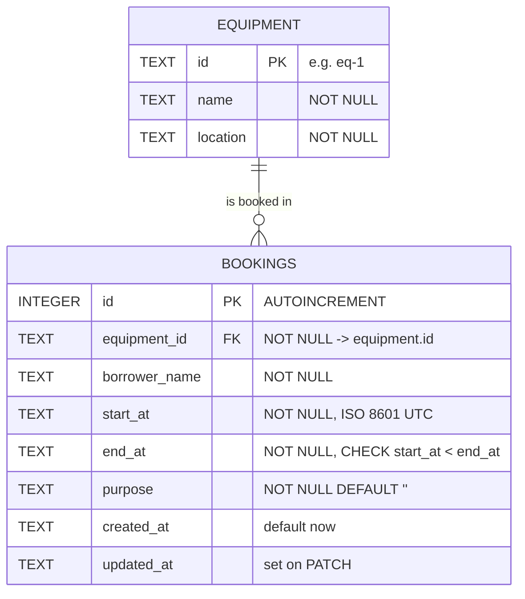

# Campus Equipment Booking API

A REST API for reserving shared faculty equipment (projectors, cameras, meeting rooms). It **prevents the same equipment from being booked for overlapping times**.

**Stack:** Cloudflare Workers · Hono · TypeScript · Cloudflare D1 (SQLite) · zod validation

- **Base API URL (live):** `https://equipment-booking-api.kanthiphs.workers.dev/api`
- **Base API URL (local):** `http://localhost:8787/api`

| Document | Contents |
|---|---|
| [`API_CONTRACT.md`](API_CONTRACT.md) | Endpoints, payloads, status codes and the reasons for them, assumptions |
| [`EVIDENCE.md`](EVIDENCE.md) | 28 test cases: request (curl), expected vs. actual status, response body. **28/28 pass live** ([`evidence/v2-live-run.txt`](evidence/v2-live-run.txt)) |
| [`QUALITY_GATE_REVIEW.md`](QUALITY_GATE_REVIEW.md) | Findings → fixes → evidence |
| [`AI_LOG.md`](AI_LOG.md) | AI prompts, what was used, what was verified |
| `evidence/` | Raw test output: v1 before the Quality Gate (22/28), v2 after it (28/28 local, 28/28 live) |

## Run locally

Requires Node.js 18 or newer.

```bash
npm install
npm run db:local        # create tables + seed 3 equipment records in local D1
npm run dev             # API at http://localhost:8787/api
```

In a second terminal:

```bash
curl http://localhost:8787/api/equipment
node scripts/evidence.mjs http://localhost:8787/api     # runs all cases, writes EVIDENCE.md
```

## Deploy to Cloudflare (D1)

The D1 database `equipment-booking` already exists. Its id is in `wrangler.jsonc`, and the schema and seed are applied.

```bash
npx wrangler login
npm run db:remote       # safe to re-run: CREATE TABLE IF NOT EXISTS + INSERT OR IGNORE
npm run deploy          # prints the live URL
node scripts/evidence.mjs https://equipment-booking-api.kanthiphs.workers.dev/api
```

## Schema / ERD



Text version: `equipment (1) ──< (many) bookings`. Each booking belongs to exactly one piece of equipment, and one piece of equipment can have many bookings.

Design choices:
- **Times are stored as text in a single UTC format** (`2026-10-20T09:00:00.000Z`). Every input is normalised to this format with `new Date(x).toISOString()`, so comparing the strings in SQL gives the same result as comparing the times. That makes `start_at < ?` correct.
- **Rules are enforced twice.** The app (zod) gives clear 400 messages. The database adds a `FOREIGN KEY` and `CHECK (start_at < end_at)` as a last line of defence.
- **Index** `(equipment_id, start_at, end_at)` keeps the overlap lookup fast.
- **Columns are snake_case in the database and camelCase in the API**; aliases in `SELECT` map one to the other.

## Security

- **Parameter binding everywhere.** Every value goes through `.bind(...)`, and no request data is ever concatenated into SQL. Test case 25 stores `x'); DROP TABLE bookings;--` as plain text.
- **Strict validation.** Types, lengths and the date format are checked, and unknown fields are rejected, so a client can't set `id` or `createdAt`.
- **Errors never leak** stack traces or SQL. Unexpected errors return `{ "error": "Internal server error" }` and are logged on the server.
- **CORS** is enabled (`cors()`) only so a browser-based tester could be used. curl doesn't need it.

## Project layout

```
src/index.ts            all routes, validation, SQL
schema.sql              tables, constraints, index, seed
scripts/evidence.mjs    test runner -> EVIDENCE.md
wrangler.jsonc          Worker + D1 binding
```
